# QR Payment Notifications - Backend Implementation Required

## 📋 RESUMEN EJECUTIVO

La app móvil Cobra tiene implementado un sistema de notificaciones en tiempo real para pagos QR, pero **requiere endpoints específicos en el backend** para funcionar. Actualmente, los usuarios no reciben notificaciones cuando completan pagos QR porque estos endpoints no están implementados.

---

## 🚨 PROBLEMA ACTUAL

### Síntomas Reportados:
- ✅ QR se genera correctamente (endpoint `/api/payments/generate-instalment-qr/{id}` funciona)
- ✅ Usuarios pueden escanear y pagar con Yape/Plin
- ❌ **La app no muestra notificaciones de pago exitoso**
- ❌ Usuarios deben verificar manualmente si el pago se procesó

### Causa Raíz:
La app móvil intenta conectarse a dos endpoints que **NO EXISTEN** en el backend:

```
❌ GET /api/payment-stream/{order_id}    (404 Not Found)
❌ GET /api/payment-events/{order_id}    (404 Not Found)
```

**Prueba realizada**: 
```bash
curl "https://cobra.mitienda.host/api/payment-stream/c88cd167-27e0-45ed-b2cc-b7aa266ab7b5"
# Resultado: 404 - Can't find a route
```

---

## 🎯 SOLUCIÓN REQUERIDA

### Endpoints a Implementar:

#### 1. **Server-Sent Events (SSE)** - Prioridad Alta
```
GET /api/payment-stream/{order_id}
Content-Type: text/event-stream
```

#### 2. **Polling Fallback** - Prioridad Alta  
```
GET /api/payment-events/{order_id}
Content-Type: application/json
```

---

## 💻 IMPLEMENTACIÓN TÉCNICA

### 1. Rutas (agregar en `app/Config/Routes.php`):

```php
// QR Payment Notifications
$routes->get('api/payment-stream/(:segment)', 'Api\PaymentNotificationController::stream/$1');
$routes->get('api/payment-events/(:segment)', 'Api\PaymentNotificationController::events/$1');
```

### 2. Controller (crear `app/Controllers/Api/PaymentNotificationController.php`):

```php
<?php

namespace App\Controllers\Api;

use CodeIgniter\RESTful\ResourceController;
use CodeIgniter\HTTP\ResponseInterface;

class PaymentNotificationController extends ResourceController
{
    protected $format = 'json';

    /**
     * Server-Sent Events endpoint
     * La app móvil se conecta aquí para recibir notificaciones en tiempo real
     */
    public function stream($orderId)
    {
        // Configurar headers para SSE
        $this->response->setHeader('Content-Type', 'text/event-stream');
        $this->response->setHeader('Cache-Control', 'no-cache');
        $this->response->setHeader('Connection', 'keep-alive');
        $this->response->setHeader('Access-Control-Allow-Origin', '*');
        
        // Log para debugging
        log_message('info', "SSE: Cliente conectado para order_id: {$orderId}");
        
        // Verificar estado del pago
        $payment = $this->checkPaymentStatus($orderId);
        
        if ($payment && $payment['status'] === 'completed') {
            // Pago encontrado - enviar notificación inmediata
            echo "event: payment_success\n";
            echo "data: " . json_encode([
                'order_id' => $orderId,
                'amount' => $payment['amount'],
                'status' => 'completed',
                'payment_method' => $payment['payment_method'] ?? 'QR',
                'timestamp' => date('Y-m-d H:i:s')
            ]) . "\n\n";
            
            log_message('info', "SSE: Pago completado enviado para order_id: {$orderId}");
        } else {
            // Pago pendiente - enviar heartbeat
            echo ": heartbeat " . date('Y-m-d H:i:s') . "\n\n";
            log_message('info', "SSE: Heartbeat enviado para order_id: {$orderId}");
        }
        
        flush();
        exit;
    }

    /**
     * Polling endpoint (fallback si SSE falla)
     * La app consulta este endpoint cada 3 segundos
     */
    public function events($orderId)
    {
        log_message('info', "POLLING: Consulta para order_id: {$orderId}");
        
        $payment = $this->checkPaymentStatus($orderId);
        
        if ($payment && $payment['status'] === 'completed') {
            return $this->respond([
                'status' => 'completed',
                'order_id' => $orderId,
                'amount' => $payment['amount'],
                'payment_method' => $payment['payment_method'] ?? 'QR',
                'timestamp' => date('Y-m-d H:i:s')
            ]);
        } else {
            return $this->respond(['status' => 'pending']);
        }
    }

    /**
     * Verificar estado del pago en la base de datos
     */
    private function checkPaymentStatus($orderId)
    {
        $db = \Config\Database::connect();
        
        // AJUSTAR: Usar la tabla y campos correctos de tu base de datos
        $builder = $db->table('payments'); // ← Cambiar por tu tabla de pagos
        
        $payment = $builder->select('id, order_id, amount, status, payment_method, created_at')
                          ->where('order_id', $orderId)
                          ->orderBy('id', 'DESC')
                          ->get()
                          ->getRowArray();
        
        log_message('info', "DB Query: order_id={$orderId}, found=" . ($payment ? 'YES' : 'NO'));
        
        return $payment;
    }
}
```

### 3. Base de Datos:

**IMPORTANTE**: Asegurar que cuando se procese un webhook de Yape/Plin, se actualice el registro con:

```sql
UPDATE payments 
SET status = 'completed', 
    payment_method = 'QR',
    updated_at = NOW()
WHERE order_id = '{order_id_from_webhook}';
```

---

## 🔄 FLUJO COMPLETO

```mermaid
sequenceDiagram
    participant U as Usuario
    participant A as App Móvil
    participant B as Backend Cobra
    participant Y as Yape/Plin

    U->>A: Presiona "Generar QR"
    A->>B: GET /api/payments/generate-instalment-qr/{id}
    B->>A: {order_id, qr_image_url}
    
    A->>B: GET /api/payment-stream/{order_id} (SSE)
    Note over A,B: Conexión abierta esperando notificación
    
    U->>Y: Escanea QR y paga
    Y->>B: Webhook de pago exitoso
    B->>B: UPDATE payments SET status='completed'
    
    A->>B: GET /api/payment-stream/{order_id}
    B->>A: event: payment_success + data
    A->>U: 🎉 "¡Pago Recibido! S/ XX.XX"
```



---

## 🧪 TESTING

### Casos de Prueba:

#### 1. **Test SSE Endpoint:**
```bash
curl -N -H "Accept: text/event-stream" \
  "https://cobra.mitienda.host/api/payment-stream/test-order-123"

# Esperado (pago pendiente):
: heartbeat 2025-08-25 15:30:00

# Esperado (pago completado):
event: payment_success
data: {"order_id":"test-order-123","amount":10.50,"status":"completed"}
```

#### 2. **Test Polling Endpoint:**
```bash
curl "https://cobra.mitienda.host/api/payment-events/test-order-123"

# Esperado (pago pendiente):
{"status":"pending"}

# Esperado (pago completado):
{
  "status":"completed",
  "order_id":"test-order-123",
  "amount":10.50,
  "payment_method":"QR"
}
```

#### 3. **Test con QR Real:**
1. Generar QR desde la app
2. Verificar logs: `tail -f /path/to/logs/codeigniter.log | grep "SSE\|POLLING"`
3. Simular webhook de pago exitoso
4. Verificar que la app reciba la notificación

---

## 🔧 CONFIGURACIÓN ADICIONAL

### Headers CORS (si es necesario):
```php
// En app/Config/Filters.php o en el controller
$response->setHeader('Access-Control-Allow-Origin', '*');
$response->setHeader('Access-Control-Allow-Methods', 'GET, OPTIONS');
$response->setHeader('Access-Control-Allow-Headers', 'Content-Type, Accept');
```

### Logs de Debug:
Habilitar logs detallados en `app/Config/Logger.php`:
```php
public $threshold = 4; // Para ver logs de info()
```

---

## ⚡ PRIORIDAD Y TIMELINE

| Tarea | Prioridad | Tiempo Estimado |
|-------|-----------|-----------------|
| Crear controller y rutas | 🔴 Alta | 2 horas |
| Implementar lógica de base de datos | 🔴 Alta | 1 hora |
| Testing con QR reales | 🟡 Media | 1 hora |
| Optimizaciones de performance | 🟢 Baja | 1 hora |

**TOTAL ESTIMADO: 5 horas**

---

## 🐛 DEBUGGING

### Logs a Reviever:
```bash
# En el servidor
tail -f /var/log/apache2/access.log | grep payment-stream
tail -f /path/to/codeigniter/logs/*.log | grep "SSE\|POLLING"
```

### En la App Móvil:
Los logs aparecerán con el prefijo `[QR]`:
```
[QR] Iniciando monitoreo para QR ID: c88cd167-27e0-45ed-b2cc-b7aa266ab7b5
PaymentNotificationService: Iniciando monitoreo para QR: c88cd167...
```

---

## 📞 CONTACTO

**Desarrollador Frontend**: Carlos  
**Fecha**: 2025-08-25  
**Prioridad**: 🔴 **CRÍTICA** - Los usuarios no pueden confirmar pagos QR  

---

## ✅ CHECKLIST DE IMPLEMENTACIÓN

- [ ] Crear `PaymentNotificationController.php`
- [ ] Agregar rutas en `Routes.php`
- [ ] Configurar CORS si es necesario
- [ ] Actualizar lógica de webhooks para marcar pagos como 'completed'
- [ ] Probar SSE endpoint manualmente
- [ ] Probar polling endpoint manualmente
- [ ] Probar flujo completo con QR real
- [ ] Verificar logs de la app móvil
- [ ] ✅ **VALIDAR**: Usuario recibe notificación "¡Pago Recibido!"

---

*Una vez implementados estos endpoints, el sistema de notificaciones QR funcionará automáticamente sin cambios en la app móvil.*